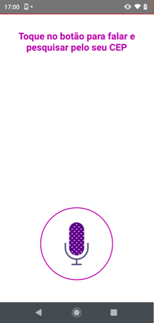
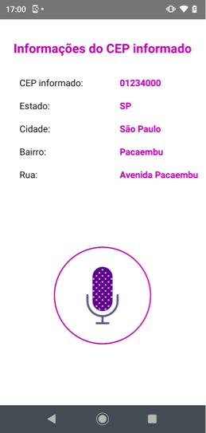

<div align="center">
  <div style="float: left; width: 50%">
    
    </div>
  <div style="float: left; width: 50%">
    
  </div>
</div>  

## :computer: Projeto

Aplicação para prova de conceito de reconhecimento de voz integrando com APIS.
Para essa POC foi utilizado uma API de consulta de CEP

## :pushpin: Tecnologias

Esse projeto foi desenvolvido com as seguintes tecnologias:

- [React Native](https://reactnative.dev/)
- [react-native-voice](https://github.com/react-native-community/voice)


## :collision: API para consulta de CEP

__*GET*__ *https://api.pagar.me/1/zipcodes/seu-cep-aqui* 


## :point_down: Executando o projeto

No seu terminal copie e cole ou digite o comando abaixo:

```git
git clone https://github.com/jhowsantos/pocMegahackVtex.git
````

Após realizar o clone acesse a pasta do projeto:

```git
cd pocMegahackVtex
````

Logo em seguida digite o comando __*yarn*__ para baixar e atualizar as dependências do projeto

Para executar o projeto digite em seu terminal o comando:

_**Para Android**_
```terminal
yarn android
````
_**Para IOS**_
```terminal
yarn ios
````

---
Feito com coração, café e muito esforço :heart: :rocket: